# Xfl3d
Fun scientific animations using OpenGL shaders

# Description
Xfl3d provides a set of 2d and 3d animations based on OpenGL and the Qt framework. These animations were implemented during the development of flow5 to experiment with OpenGL features.

## Mandelbrot and Julia Sets
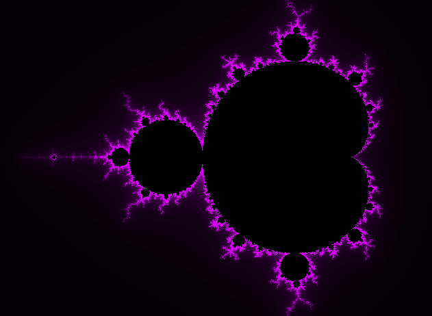

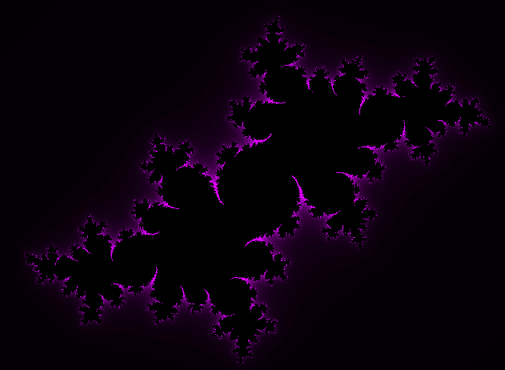

## Newton fractal
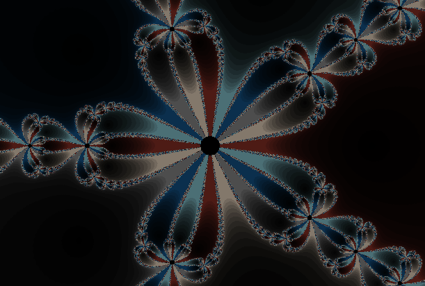

## Quaternion Julia set
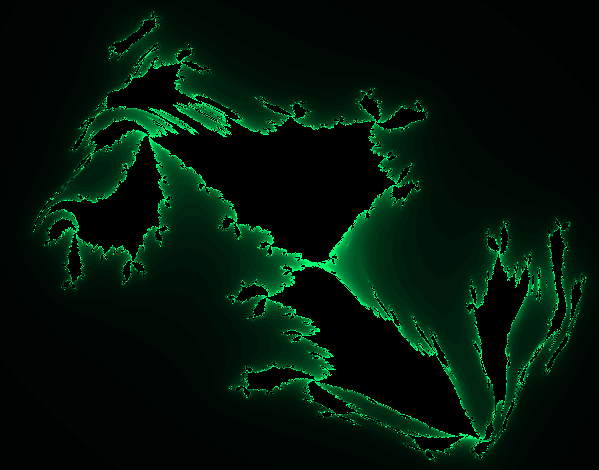

## Shadow
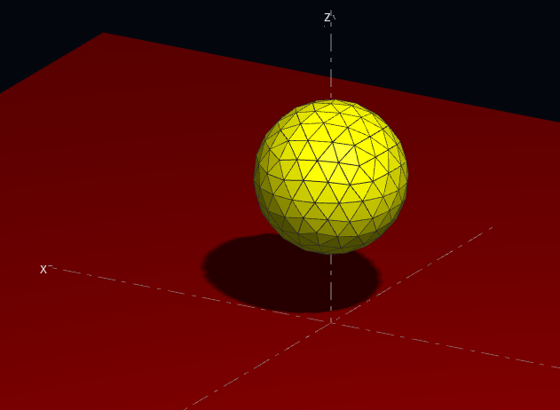

## Hydrogen atom
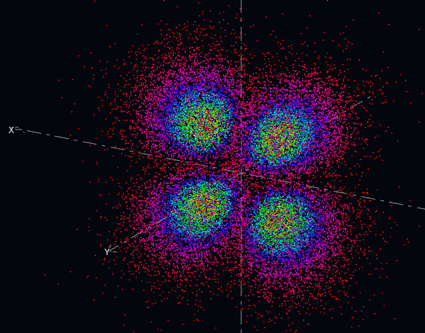

## Flight
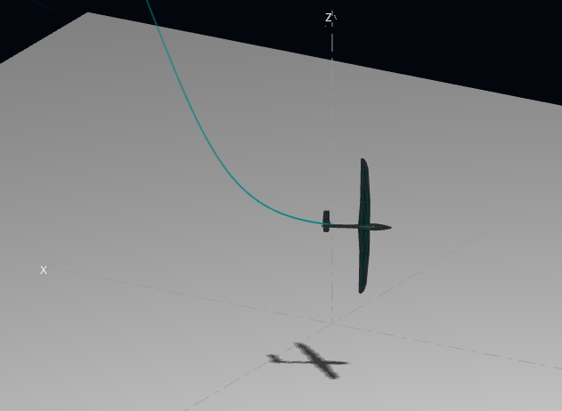

## Attractors

### Lorenz CPU based
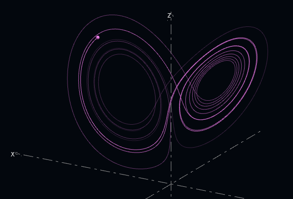

### Lorenz GPU based
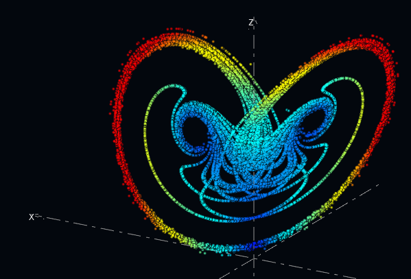

### More attractors
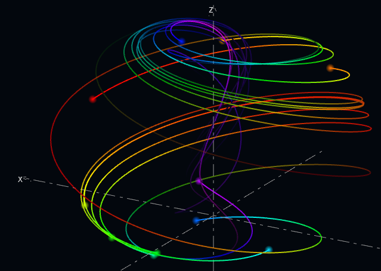

## Solar system
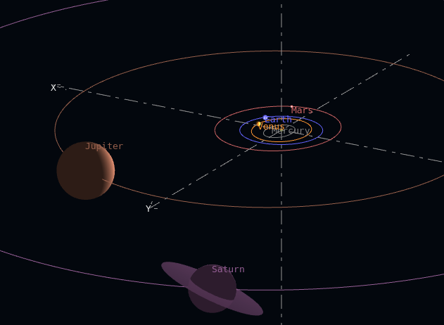

## Sagittarius A*
[Sagittarius A*](https://en.wikipedia.org/wiki/Sagittarius_A*)

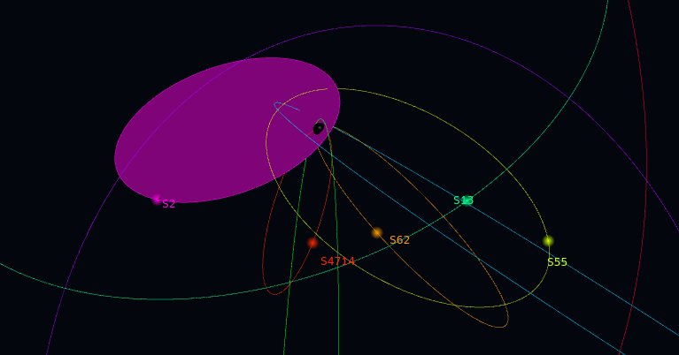

## NEARGALCAT (Nearby Galaxy Catalog)

[NEARGALCAT](https://heasarc.gsfc.nasa.gov/W3Browse/catalog/neargalcat.html)

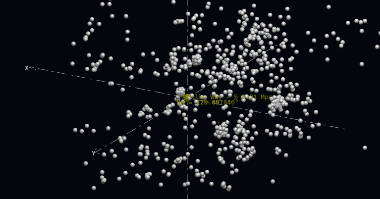

## Particle swarm optimization (PSO) and Genetic Algorithm (GA) optimization
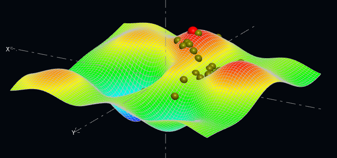

## Boids

[https://en.wikipedia.org/wiki/Boids](https://en.wikipedia.org/wiki/Boids)

### CPU based
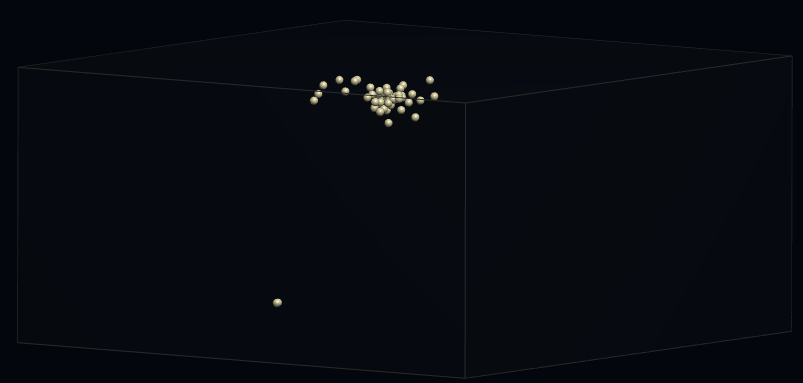

### - GPU based

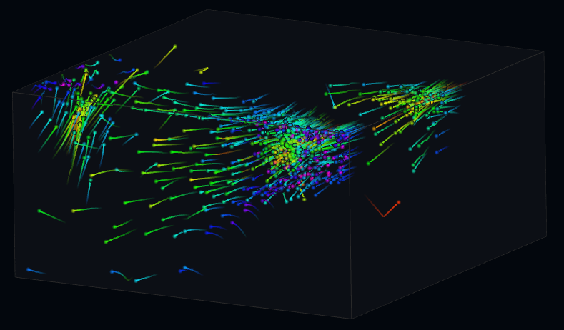

## Vortex flow
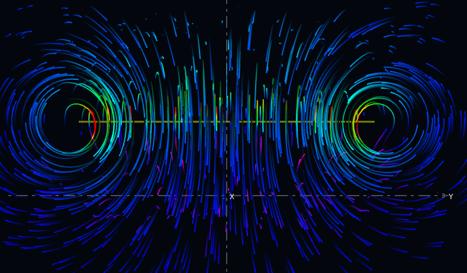

# Usage
## Mouse
Pan:    left mouse button

Zoom:   mouse wheel

Rotate: Ctrl or mouse middle button to activate the arcball, then click on the arcball and mouse move

## Keyboard shortcuts
`R:       ` Reset the scale

`I:       ` Switch to pseudo-isometric view

`X:       `  Front x-view

`Shift + X:` Back x-view

`Y:       `  Front y-view

`Shift + Y:` Back y-view

`Z:       `  Front z-view

`Shift + Z:` Back z-view

`H:        ` Flip horizontally

`V:        ` Flip vertically

# Compilation
## Linux
- Use your distribution's package manager to install the Qt6()-dev and Mesa()-dev libraries
- `qmake`
- `make`
- `sudo make install`
- `Xfl3d` to run

## Windows
- Install the Qt6 development libraries from the Qt site
- Compile and run in release mode

## MacOS
- Not available: Some of the animations require OpenGL 4.3+ whereas MacOS only provides OpenGL 4.1
